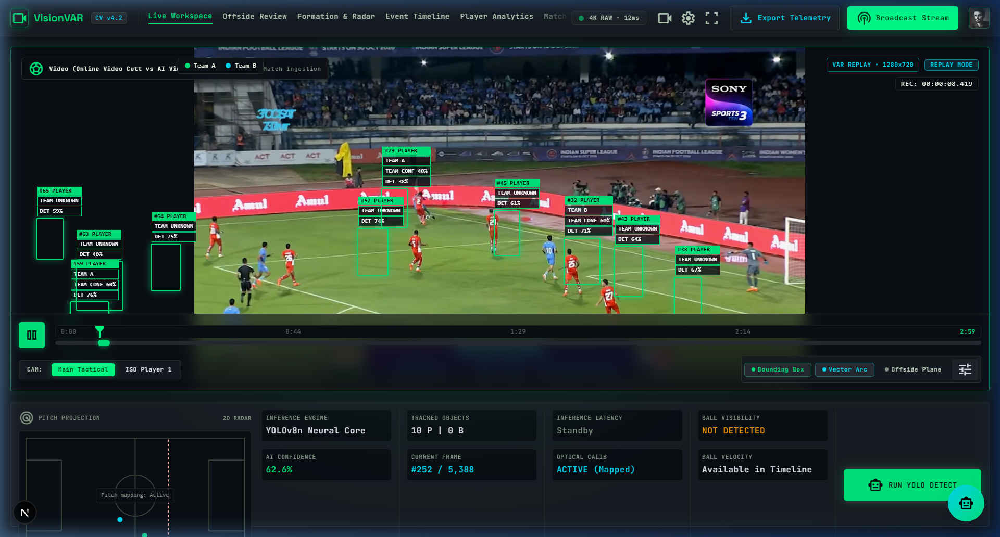
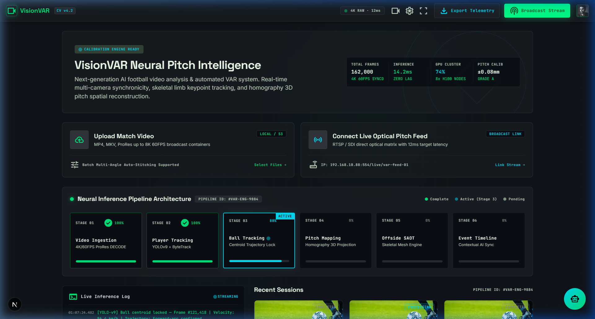
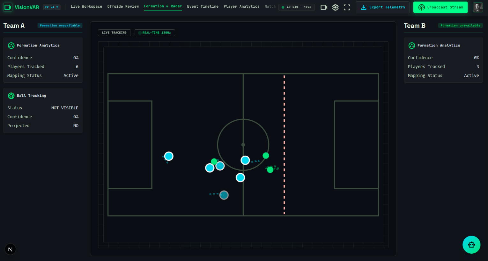
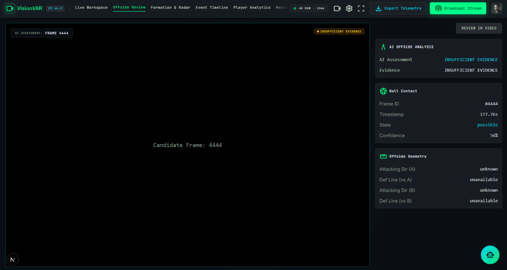
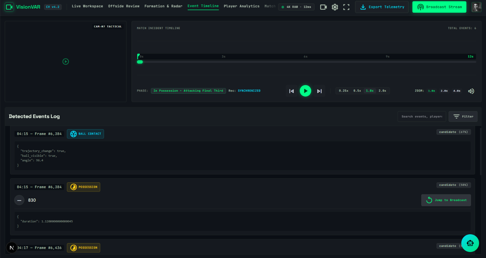
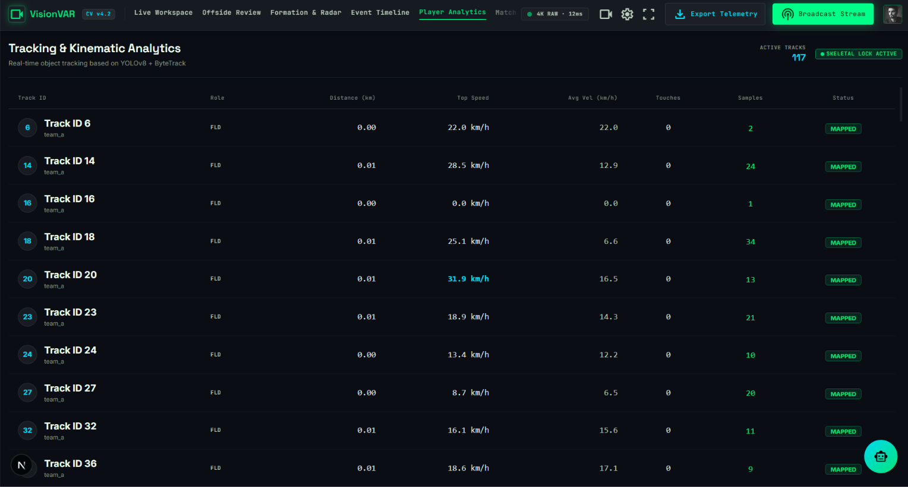
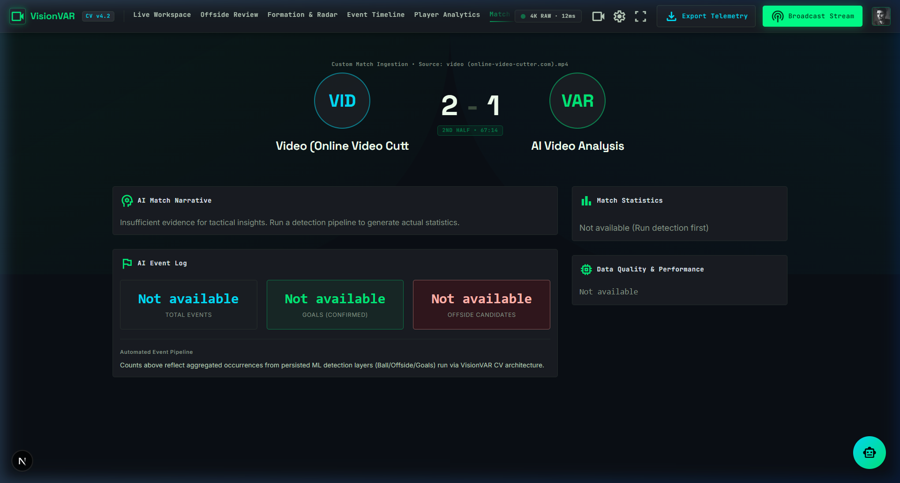
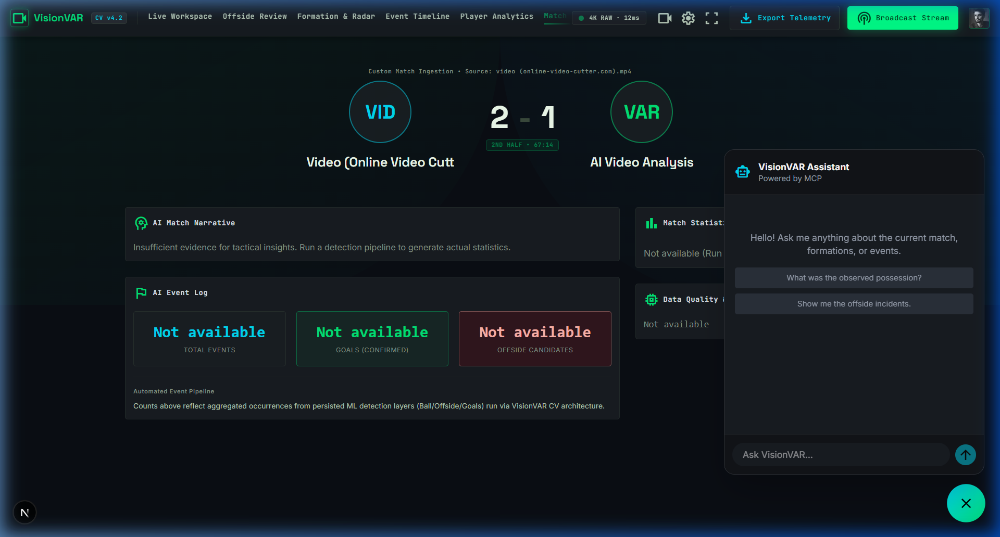
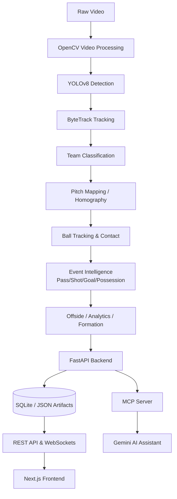

# ⚽ VisionVAR

### AI-Powered Football Video Intelligence & VAR-Style Decision Support

VisionVAR is a sophisticated full-stack AI platform that provides automated football video analysis and VAR-style decision support. It uses computer vision to extract player tracks, ball movement, and pitch coordinates, presenting the intelligence via an interactive Next.js dashboard and a Gemini-powered AI assistant.

[](https://nextjs.org/)
[](https://fastapi.tiangolo.com/)
[](https://ultralytics.com/)
[](https://sqlite.org/)



[Features](#-features) | [Application Showcase](#%EF%B8%8F-application-showcase) | [Architecture](#%EF%B8%8F-architecture) | [AI Assistant](#-ai-assistant) | [Tech Stack](#-tech-stack) | [Installation](#%EF%B8%8F-installation)

---

## ⚡ Features

| Core Pipeline | Match Intelligence | Technical Features |
|:---|:---|:---|
| ✅ **YOLOv8 Detection** (Players & Ball) | ✅ **Offside Analysis** (VAR-style candidate evaluation) | ✅ **Live WebSocket Analysis** (Real-time telemetry) |
| ✅ **ByteTrack Tracking** (Frame-to-frame continuity) | ✅ **Pass & Shot Detection** | ✅ **VOD Replay** (Frame-synchronized historical playback) |
| ✅ **Team Classification** (K-Means jersey clustering) | ✅ **Goal Detection** | ✅ **Model Context Protocol (MCP)** integration |
| ✅ **Pitch Mapping** (Homography 3D projection) | ✅ **Possession & Turnover Tracking** | ✅ **Gemini AI Assistant** (Chat with match data) |
| ✅ **Formation Analysis** (Tactical shape estimation) | ✅ **Player Analytics** (Distance, Speed, Touches) | ✅ **Event Timeline** |
| ✅ **Ball Contact Detection** | ✅ **Match Summary** | ✅ **Database Persistence** (SQLite) |

---

## 🖥️ Application Showcase

### Dashboard
The main entry point displaying analyzed and actively processing sessions.


### Live Workspace
Real-time telemetry and streaming bounding boxes powered by WebSockets during active YOLO inference.


### Formation & Pitch Radar
Dynamic homography-based projection mapping player coordinates to a 2D tactical pitch.


### Offside Review
VAR-style decision support analyzing attacker and defender positioning relative to the offside line at the exact moment of ball contact.


### Event Timeline
Chronological log of passes, shots, turnovers, and offside candidates.


### Player Analytics
Aggregated telemetry including total distance covered, top speed, and estimated touches per Track ID.


### Match Summary
High-level overview of match statistics, possession breakdowns, and tactical insights.


### Gemini Assistant
Context-aware AI chat interface allowing natural language queries against the match data.


---

## 🏗️ Architecture



### Analysis Modes: VOD vs. Live

**Historical VOD Replay**
```text
Video → Analysis → tracking_results.json → Frame Synchronization → Historical UI Overlay
```

**Live Workspace**
```text
Video → LiveAnalysisRunner → Background CV Pipeline → WebSocket Telemetry → Live UI Overlay
```

---

## 🤖 AI Assistant (MCP + Gemini)

VisionVAR implements the **Model Context Protocol (MCP)** to securely expose match telemetry to a Gemini AI assistant without leaking database access or API keys to the frontend.

```text
User Query → Gemini → MCP Tool Call → VisionVAR Backend/Data → Gemini Response
```

**Example Queries:**
- *"What formation was detected for the Home Team?"*
- *"Which Track ID covered the most distance?"*
- *"What offside incidents were detected in the match?"*
- *"What events occurred around the 24th minute?"*
- *"Is there enough evidence for an offside assessment?"*

*Security Note: The Gemini API key remains strictly on the backend. MCP tools are purely read-only (e.g., `get_events`, `get_match_summary`), preventing arbitrary data mutation.*

---

## 🎬 Demo

<!-- Placeholder for future GitHub-hosted demo video/GIF -->
*(A short video demonstration showing video playback, player tracking, pitch radar, and timeline synchronization will be added here).*

---

## 💻 Tech Stack

| Domain | Technologies |
|:---|:---|
| **Frontend** | Next.js (App Router), React, TypeScript, Tailwind CSS |
| **Backend** | FastAPI, Python, SQLAlchemy, WebSockets, Uvicorn |
| **Database** | PostgreSQL (via Supabase) / SQLite (Local dev) |
| **Computer Vision** | OpenCV, YOLOv8 (Ultralytics), ByteTrack, Homography, K-Means |
| **AI** | Model Context Protocol (MCP), Google Gemini |
| **Deployment** | Vercel (Frontend), Render / Hugging Face Spaces (Backend), Supabase (Database) |

---

## ⚙️ Installation

### 1. Clone the Repository
```bash
git clone https://github.com/yourusername/visionvar.git
cd visionvar
```

### 2. Backend Setup
Requires Python 3.10+.
```bash
cd backend
python -m venv venv
source venv/bin/activate  # On Windows: venv\Scripts\activate
pip install -r requirements.txt
```

### 3. Environment Variables
Create a `.env` file in the project root:
```env
GEMINI_API_KEY=your_gemini_api_key_here
```

### 4. Start the Backend
```bash
# From the project root
python -m uvicorn backend.app.main:app --host 0.0.0.0 --port 8000
```
*Note: Ensure the required YOLOv8 weights (e.g., `yolov8n.pt`) are available in the project root or they will be downloaded automatically by Ultralytics on first run.*

### 5. Start the Frontend
```bash
cd visionvar-app
npm install
npm run dev
```

The application will be accessible at **[http://localhost:3000](http://localhost:3000)**.

---

## 📊 Performance & Testing

These are tested prototype measurements based on current development benchmarks:
- **Inference Speed:** ~5–10 FPS on a standard CPU using YOLOv8n.
- **Test Coverage:** 87 automated backend tests covering tracking logic, event detection, analytics, and session isolation (`pytest backend/tests -v`).
- **Frontend:** Fully passes Next.js production static and dynamic builds (`npm run build`).

---

## ⚠️ Limitations

VisionVAR is a **VAR-style decision-support prototype** and computer vision research tool. It is **not** a professional VAR system.
- **Detection:** Uses a general-purpose YOLOv8n model, not explicitly fine-tuned for football. Fast/small ball tracking can be challenging.
- **Identity:** "Track IDs" represent continuous tracking objects, not real-world player identities (no facial/jersey number Re-ID).
- **Pitch Mapping:** Relies on hardcoded coordinate assumptions for standard midfield broadcast camera angles. It will fail on extreme tactical or drone camera angles.
- **Processing:** Designed for asynchronous processing. True 30+ FPS real-time processing requires GPU hardware acceleration.

---

## 🗺️ Roadmap

### V1.0 — Completed ✅
- End-to-end CV pipeline (Detection → Tracking → Pitch Mapping → Events).
- Live WebSocket and VOD replay modes.
- Match analytics, timeline, and offside decision support.
- Secure MCP integration with Gemini Assistant.

### V2.0 — Future Research
- ⚽ **Football-specific object detection** (Fine-tuned models).
- 🔄 **Player Re-ID** (Robust identity persistence across tracking gaps).
- 🎥 **Dynamic camera-motion compensation** for robust pitch mapping across diverse angles.
- ⏱️ **TrackNet/temporal evaluation** for high-speed ball tracking.
- 📹 **Multi-camera synchronization** for true 3D spatial reconstruction.

---
